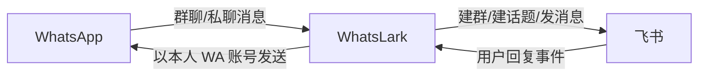

# WhatsLark · WhatsApp ↔ 飞书双向消息同步

WhatsLark 是一个单进程消息桥，用于把 WhatsApp 群聊与私聊同步到飞书，并把飞书里的回复发回 WhatsApp。

- **群聊同步**：每个 WhatsApp 群自动映射到一个独立飞书群。
- **私聊归集**：所有 WhatsApp 私聊归集到一个飞书话题群，每个联系人对应一个话题。
- **双向实时同步**：WhatsApp 新消息同步到飞书；飞书回复会以你的 WhatsApp 账号身份发回对应会话。
- **媒体支持**：支持文本、图片、文件、语音；不支持的消息类型会降级为文本提示。
- **文件化运维**：无 Web 页面，通过配置文件、状态文件和容器内 CLI 管理。

---

## 技术栈

- Runtime：Node.js 20+ / TypeScript
- WhatsApp：[@whiskeysockets/baileys](https://baileys.wiki)
- 飞书：[@larksuiteoapi/node-sdk](https://github.com/larksuite/node-sdk) Client + WSClient 长连接
- 存储：SQLite（better-sqlite3）
- 部署：Docker / Docker Compose

---

## 工作方式



### WhatsApp → 飞书

1. 接收 WhatsApp 群聊或私聊消息。
2. 自动创建或复用飞书群 / 私聊话题。
3. 上传媒体资源并发送消息到飞书。
4. 写入去重记录，避免重复投递。

### 飞书 → WhatsApp

1. 通过飞书长连接接收 `im.message.receive_v1` 事件。
2. 过滤机器人消息，避免回环。
3. 根据群或话题映射找到 WhatsApp 目标会话。
4. 通过 Baileys 以当前登录的 WhatsApp 账号发送。

---

## 目录结构

```text
src/
  index.ts            入口：初始化数据库、启动 App 与 Monitor
  config.ts           环境变量配置
  logger.ts           pino 分模块日志
  types.ts            共享类型
  db.ts               SQLite 数据层：建表、映射、去重、配置、WA authState
  app.ts              协调层：装配 WhatsApp、飞书、路由与热加载
  monitor.ts          配置监听、命令文件处理、状态文件输出
  whatsapp/
    auth-sqlite.ts    SQLite 版 Baileys authState
    socket.ts         WhatsApp socket：连接、重连、QR、消息、群信息、媒体
  feishu/
    client.ts         飞书 REST Client：建群、建话题群、发消息、上传媒体、改名
    ws.ts             飞书 WSClient 长连接：订阅消息事件
  bridge/
    router.ts         双向路由核心：映射、同步、去重、防回环
    mutex.ts          按 key 串行锁，避免并发重复建群/话题
bin/
  whatslark.sh        容器内 CLI：status / feishu-set / wa-login / mappings 等
```

---

## 本地运行

```bash
npm install
npm run build
npm start
```

开发模式：

```bash
npm run dev
```

默认数据目录为 `./data/`：

- SQLite 数据库：`./data/bridge.db`
- 飞书配置：`./data/config.json`
- 服务状态：`./data/status.json`
- 一次性命令：`./data/cmd/`

---

## 配置方式

WhatsLark 不提供 Web 配置页。所有配置和操作通过以下两种方式完成：

1. 编辑挂载目录中的配置文件。
2. 使用容器内 CLI：`docker exec whatslark whatslark <cmd>`。

### 飞书配置

首次启动会在数据目录生成 `config.json` 模板：

```json
{
  "app_id": "cli_xxx",
  "app_secret": "你的应用密钥",
  "my_open_id": "ou_xxx",
  "bot_open_id": ""
}
```

字段说明：

| 字段 | 必填 | 说明 |
|---|---:|---|
| `app_id` | 是 | 飞书企业自建应用的 App ID |
| `app_secret` | 是 | 飞书企业自建应用的 App Secret |
| `my_open_id` | 强烈建议 | 自动建群时要拉入的飞书用户 open_id；不填可能看不到同步消息 |
| `bot_open_id` | 否 | 机器人 open_id，通常可留空 |

修改 `config.json` 后服务会自动热加载，无需重启容器。

也可以使用 CLI 设置：

```bash
docker exec whatslark whatslark feishu-set cli_xxx mysecret ou_yyy
```

> 省略第三个参数时，CLI 会保留原有 `my_open_id`，不会清空。

### 飞书开发者后台准备

在飞书开放平台中创建企业自建应用，并完成以下配置：

1. 开启机器人能力。
2. 开通并发布以下权限：
   - `im:chat:create`
   - `im:chat:update`
   - `im:message`
   - `im:message:send_as_bot`
   - `im:resource`
   - `im:chat.members:write_only`
3. 在「事件与回调」中订阅 `im.message.receive_v1`。
4. 订阅方式选择长连接。通常需要先启动本服务，让长连接建立后再保存订阅配置。

### WhatsApp 登录

```bash
# 触发登录，QR 会打印到容器日志
docker exec whatslark whatslark wa-login

# 查看日志并用手机 WhatsApp 扫码
docker compose logs -f whatslark
```

手机端路径：**WhatsApp → 设置 → 已关联的设备 → 关联新设备 → 扫描日志里的二维码**。

说明：

- 二维码会周期性刷新，过期后自动重新输出。
- 已登录时再次执行 `wa-login` 不会重复弹码。
- 登录态保存在 SQLite 中；只要 `/data` 持久化，容器重建后可自动重连。

---

## CLI 命令

在容器内使用：

```bash
docker exec whatslark whatslark <cmd>
```

| 命令 | 说明 |
|---|---|
| `status` | 查看服务状态：飞书配置、WhatsApp 连接状态、映射数量 |
| `feishu-config` | 查看当前飞书配置，密钥会脱敏显示 |
| `feishu-set <id> <secret> [open_id]` | 写入飞书配置并触发热加载 |
| `wa-login` | 触发 WhatsApp 登录，QR 打印到日志 |
| `wa-logout` | 登出 WhatsApp 并清除登录态 |
| `mappings` | 查看 WhatsApp 与飞书的群/私聊话题映射 |
| `help` | 显示帮助信息 |

示例：

```bash
docker exec whatslark whatslark status
docker exec whatslark whatslark feishu-config
docker exec whatslark whatslark mappings
```

---

## Docker 部署

### 首次部署

```bash
# 1. 克隆仓库
git clone <repo-url>
cd whatslark

# 2. 构建并启动
docker compose up -d --build

# 3. 配置飞书：编辑 ./data/config.json，或使用 CLI
docker exec whatslark whatslark feishu-set cli_xxx mysecret ou_yyy

# 4. 登录 WhatsApp
docker exec whatslark whatslark wa-login
docker compose logs -f whatslark

# 5. 验证状态
docker exec whatslark whatslark status
```

### 数据持久化

Docker Compose 默认将宿主机 `./data` 挂载到容器 `/data`。以下内容都会保存在该目录中：

- SQLite 数据库
- WhatsApp 登录凭证
- 飞书配置文件
- 服务状态文件
- 一次性命令文件

只要保留 `./data`，重建容器不会丢失登录态和映射关系。

### 备份

```bash
docker compose stop
cp -r ./data ./data-backup-$(date +%Y%m%d)
docker compose start
```

### 升级

```bash
git pull origin main
docker compose up -d --build
docker compose logs -f --tail 50
```

---

## 环境变量

| 变量 | 默认值 | 说明 |
|---|---|---|
| `DB_PATH` | `./data/bridge.db` | SQLite 数据库路径 |
| `DATA_DIR` | `DB_PATH` 所在目录 | 配置文件、状态文件、命令文件目录 |
| `LOG_LEVEL` | `info` | 日志级别 |
| `SEND_INTERVAL_MS` | `600` | 发送消息限速间隔 |
| `HISTORY_INTERVAL_MS` | `400` | 历史消息同步限速间隔 |
| `GROUP_SYNC_INTERVAL_MS` | `1500` | 登录后批量建群限速间隔 |
| `DEDUP_RETENTION_DAYS` | `7` | 去重记录保留天数 |
| `SYNC_ALL_GROUPS` | `true` | 登录后是否自动创建所有 WhatsApp 群对应的飞书群 |
| `SYNC_FULL_HISTORY` | `true` | 是否尝试同步 WhatsApp 历史消息 |
| `MAX_MEDIA_BYTES` | `52428800` | 最大媒体大小；超出后降级为文本提示 |

完整定义见 [`src/config.ts`](src/config.ts)。

---

## 已知限制与风险

- **WhatsApp 封号风险**：Baileys 是非官方库，自动化个人账号存在封号概率。建议使用可接受风险的账号，避免群发和高频操作。
- **历史消息不完整**：WhatsApp 多设备协议通常只返回有限近期历史，不保证同步全部聊天记录。
- **单实例部署**：飞书 WSClient 长连接不适合多实例广播，本项目按单进程单实例设计。
- **媒体类型有限**：文本、图片、文件、语音为主要支持类型；贴纸、位置、名片等会降级为文本提示。
- **富文本降级**：飞书富文本回复会解析为纯文本后发送到 WhatsApp。
- **凭证安全**：`app_secret` 与 WhatsApp 登录凭证保存在 SQLite 中。请保护好宿主机 `./data` 目录，不要提交或公开分享。

---

## 常用排查

### 看不到飞书消息

1. 确认 `my_open_id` 已配置，且应用有权限把你拉进群。
2. 执行 `docker exec whatslark whatslark status` 查看飞书与 WhatsApp 状态。
3. 查看容器日志：`docker compose logs -f whatslark`。

### WhatsApp 未连接

1. 执行 `docker exec whatslark whatslark wa-login`。
2. 在容器日志中扫描新的 QR 码。
3. 如果登录态异常，可执行 `docker exec whatslark whatslark wa-logout` 后重新登录。

### 配置修改未生效

1. 确认修改的是挂载目录中的 `./data/config.json`。
2. 检查 JSON 格式是否合法。
3. 查看日志中是否有配置热加载或飞书重连错误。

---

## License

MIT
